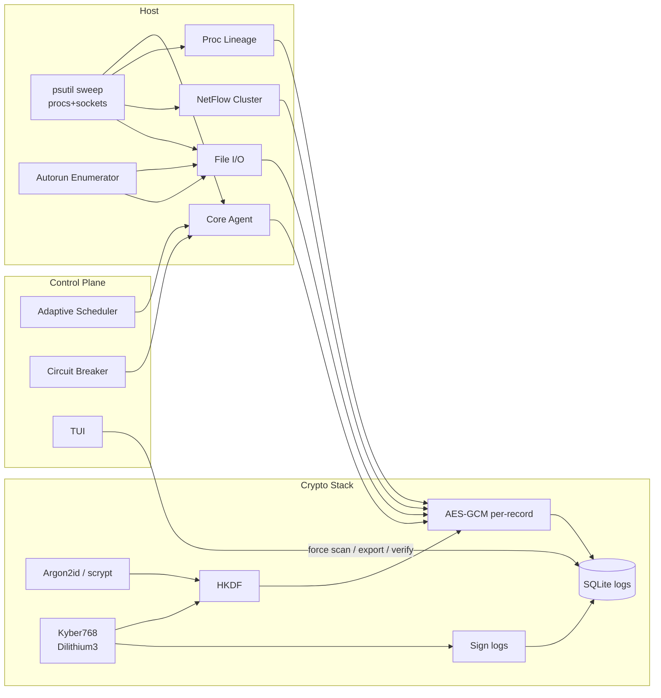

# Hypertime IDS
 


Hypertime IDS is a **quantum-inspired Intrusion Detection System (IDS)** designed for experimental research into post-quantum security and alerting.
This version runs in **alert-only mode**, logging suspicious activity without blocking traffic.


It includes:

* Post-quantum hybrid key support
* Encrypted SQLite logging backend
* OpenAI schema validation for event parsing
* TUI (Terminal User Interface) for live monitoring
* Alert-only mode (safe for testing environments)

---

## Requirements

* Windows 10/11 with PowerShell
* Python 3.10+ installed
* Git installed

Optional but recommended:

* Windows Terminal or VS Code terminal for easier management

---

## Clone the Repository

Open PowerShell and run:

```
cd C:\Users\YOUR_USERNAME\Desktop  
git clone https://github.com/lappylot/hypertime_ids_v6_alert_only  
cd hypertime_ids_v6_alert_only  
```

(Replace `YOUR_USERNAME` with your actual Windows username.)

---

## Installation

Run the provided installer script:

```
.\install.ps1  
```

This will:

* Create a virtual environment (.venv)
* Install all required Python dependencies into .venv
* Verify that your environment is ready

---

## Running the IDS

Each time you want to start Hypertime IDS:

1. Navigate into the project folder:

   ```
   cd C:\Users\YOUR_USERNAME\Desktop\hypertime_ids_v6_alert_only  
   ```

2. Allow PowerShell scripts for this session only (safe):

   ```
   Set-ExecutionPolicy -Scope Process -ExecutionPolicy Bypass  
   ```

3. Activate the virtual environment:

   ```
   .\.venv\Scripts\Activate.ps1  
   ```

4. Run the IDS:

   ```
   python main.py  
   ```

If successful, your PowerShell prompt will show `(venv)` at the beginning.

---

## Stopping the IDS

* Press Ctrl + C inside PowerShell to stop the IDS process
* Run `deactivate` to exit the virtual environment
* Closing PowerShell automatically resets the execution policy

---

## Troubleshooting

**Error: "running scripts is disabled on this system"**

Fix by allowing scripts for the current session only:

```
Set-ExecutionPolicy -Scope Process -ExecutionPolicy Bypass  
.\.venv\Scripts\Activate.ps1  
```

**Alternate activation method**

If `.ps1` activation doesn’t work, use the batch file instead:

```
.\.venv\Scripts\activate.bat  
```

**Run without activation**

You can also run IDS directly using the `.venv` Python interpreter:

```
.\.venv\Scripts\python.exe main.py  
```

---

## Running on Linux/macOS

On non-Windows systems:

1. Clone and enter the repo:

   ```
   git clone https://github.com/lappylot/hypertime_ids_v6_alert_only  
   cd hypertime_ids_v6_alert_only  
   ```

2. Create and activate venv:

   ```
   python3 -m venv .venv  
   source .venv/bin/activate  
   ```

3. Install dependencies:

   ```
   pip install -r requirements.txt  
   ```

4. Run IDS:

   ```
   python3 main.py  
   ```

5. Deactivate with:

   ```
   deactivate  
   ```

---

## Notes

* Always run IDS inside the `.venv` virtual environment
* The execution policy bypass only lasts for the current PowerShell session
* Logs are stored in an encrypted SQLite database inside the project
* IDS runs in alert-only mode (it won’t block traffic)

---

## Quickstart (Windows One-Liner)

If you already installed everything, you can restart IDS in one command:

```
cd C:\Users\YOUR_USERNAME\Desktop\hypertime_ids_v6_alert_only; Set-ExecutionPolicy -Scope Process -ExecutionPolicy Bypass; .\.venv\Scripts\Activate.ps1; python main.py  
```

---

## Roadmap

Planned features for future versions:

* Active response mode (blocking malicious traffic)
* Web dashboard for alerts
* Multi-node distributed deployment
* Extended post-quantum cryptography support

---

## License

This project is licensed under **GPL-3.0**.
See the LICENSE file for details.

 


> Post-quantum, keystore-hardened, AI-assisted host sensor with strict JSON agents and adaptive scheduling.
 
 

## Table of Contents

* [Key Capabilities](#key-capabilities)
* [Threat Model & Design Goals](#threat-model--design-goals)
* [Architecture](#architecture)
* [Cryptography (with math)](#cryptography-with-math)
* [Adaptive Scheduler (with math)](#adaptive-scheduler-with-math)
* [Agents & JSON Contracts](#agents--json-contracts)
* [Installation](#installation)

  * [Windows (PowerShell)](#windows-powershell)
  * [Linux/macOS (bash)](#linuxmacos-bash)
* [Configuration](#configuration)
* [Usage & TUI Cheatsheet](#usage--tui-cheatsheet)
* [Operational Recipes](#operational-recipes)
* [Performance & Reliability Notes](#performance--reliability-notes)
* [Limitations & Roadmap](#limitations--roadmap)
* [Appendix: Data & Crypto Layouts](#appendix-data--crypto-layouts)
* [Mini-Blog: Why AI in an IDS—Now?](#mini-blog-why-ai-in-an-idsnow)

---

## Key Capabilities

* **Post-quantum crypto end-to-end**: OQS KEM (default **Kyber768**) + **Dilithium3** signatures, per-record **AES-GCM** with **HKDF** derivation, AEAD with rich AAD.
* **Keystore-encrypted secrets**: Argon2id (fallback scrypt) to derive KEK; per-secret AES-GCM; encrypted persistence in SQLite.
* **Strict JSON agents**: Contract prompts + JSON Schema validators + output coercion; multi-agent pipeline (Core, Process Lineage, NetFlow, File I/O, Autorun).
* **Adaptive scheduler**: Truncated-exponential jitter, **CPU** load multiplier, and **QID25 color** policy for scan cadence.
* **Resilience**: Circuit breaker → offline heuristics; robust HTTP retry/backoff; sanitized printing; hardened SQLite PRAGMAs; 0600 file perms.
* **Cross-platform**: Windows, Linux, macOS; autorun sources per OS; optional beeps.

---

## Threat Model & Design Goals

* **Attacker**: Local malware attempting persistence, lateral movement, or stealth (short-lived child shells, temp execution, reverse shells).
* **Defender**: Single host operator needing auditable, tamper-evident telemetry with cryptographic integrity and minimal operational friction.
* **Goals**:

  1. **Tamper evident** logs and **verifiable** signatures.
  2. **Fail-safe** classification: schema-enforced JSON; offline heuristics on model unavailability.
  3. **Low friction** deploy: venv + local OQS build; no kernel drivers required.
  4. **No secrets spill**: AEAD + sanitizer + keystore.

---

## Architecture



* **Sweep**: processes (CPU, cmdline), sockets (inet4), open files (per-process), autoruns (cron/systemd/launchd/startup/registry).
* **Agents**: Each returns **strict JSON** (analysis\[], summary{}). Results are **AEAD-encrypted** and **Dilithium-signed** individually.
* **DB**: SQLite hardened (WAL, secure\_delete, no extensions, 0600).
* **TUI**: Start/Stop, Status, Log list+verify, Decrypt, Export, Search, Vacuum, Keystore ops.

---

## Cryptography (with math)

### Boot Key Derivation (Hybrid)

We mix a memory-hard KDF output with an OQS KEM shared secret and fresh entropy:

* Let $S \gets \text{Argon2id}(seed,\,salt_1,\,32)$ (or scrypt fallback).
* Generate OQS shared secret $s_{oqs}$ via Kyber768:

  * **self** mode: encapsulate to an ephemeral self keypair.
  * **encap** mode: encapsulate to provided public key $pk$.
* HKDF combine:

$$
\text{IKM} = S \,\|\, s_{oqs} \,\|\, r,\quad
K_{\text{boot}} = \text{HKDF}_{\text{SHA256}}(\text{IKM},\, \text{salt}_2,\, \text{info}=\text{"hypertime-ids/hybrid/v2"},\, 32)
$$

### Per-Record AEAD

For each log record:

* Derive per-record key:

$$
K_i = \text{HKDF}_{\text{SHA256}}(K_{\text{boot}},\, \text{salt}_i,\, \text{info}=\text{"hypertime-ids/log-key/v2"},\, 32)
$$

* Encrypt JSON payload with **AES-GCM** using fresh nonce $n_i$.
* AAD binds timestamp and metadata:

$$
\text{AAD} = \text{AAD\_LOG} \,\|\, \text{json}\{ts, m\}
$$

* Sign $\text{blob} = \text{salt}_i \,\|\, n_i \,\|\, \text{ct}_i$ plus $ \text{AAD} \,\|\, \text{AAD\_LOG\_META}$ using **Dilithium3**.

### Keystore

* KEK $K_{\text{KEK}} \gets $ Argon2id(passphrase, ks\_salt) (fallback scrypt).
* Per-secret key:

$$
K_{\text{sec}} = \text{HKDF}_{\text{SHA256}}(K_{\text{KEK}},\, \text{salt}_{\text{sec}},\, \text{"hypertime-ids/keystore/v2"},\, 32)
$$

* Secret ciphertext = **AES-GCM**(plaintext, nonce, AAD = `"hypertime-ids-v6/keystore-v2"`).

> **Security properties**: IND-CCA for records and secrets (AES-GCM, unique nonces), unforgeability (Dilithium3), KDF domain separation (HKDF info labels), memory hardness on user-controlled KEK.

---

## Adaptive Scheduler (with math)

### Truncated Exponential Jitter

We draw a random base delay $T \in [a, b]$ from a truncated exponential with rate $\lambda$:

* Draw $u \sim U(0,1)$
* Let $E_a = e^{-\lambda a},\; E_b = e^{-\lambda b}$
* **Inverse CDF** sample:

$$
T = -\frac{1}{\lambda}\ln\left(E_a - u\,(E_a - E_b)\right)
$$

In code, $a=\text{BASE\_MIN},\, b=\text{BASE\_MAX}$ (minutes).

### CPU Multiplier

$$
M_{\text{cpu}} =
\begin{cases}
0.45 & \text{if } \text{CPU} \ge 80\%\\
0.70 & 60\% \le \text{CPU} < 80\%\\
0.85 & 40\% \le \text{CPU} < 60\%\\
1.00 & \text{otherwise}
\end{cases}
$$

### QID25 Color Multiplier

$$
M_{\text{color}} \in \{\text{RED}=0.35,\;\text{YELLOW}=0.60,\;\text{BLUE}=0.90,\;\text{GREEN}=1.15\}
$$

### Final Delay

$$
\text{Delay} = 60 \cdot T \cdot M_{\text{cpu}} \cdot M_{\text{color}}\quad \text{(seconds)}
$$

---

## Agents & JSON Contracts

* **Core (process + sockets)**: flags CPU anomalies, unknown-PID sockets; neutral reasoning ≤20 words.
* **Process Lineage**: office→shell, browser→script, LOLBins, orphaned children, duplicate names across paths.
* **NetFlow**: PID clusters, unique remotes, reverse-shell patterns, unknown-PID sockets, notable listeners.
* **File I/O**: exec from temp/world-writable, deleted-on-disk mappings, suspicious names.
* **Autorun**: cron/systemd/launchd/startup/registry anomalies (temp paths, random names, suspicious args).

**Guarantees**:

* Outputs **only**:

  * `{"analysis":[...], "summary":{"safe":int, "suspicious":int, "malicious":int}}`
* Enforced by **jsonschema** (`Draft7Validator`) and coercion; non-conforming → safe empty object.
* Counts in `summary` must match `analysis`.

---

## Installation

### Windows (PowerShell)

**Prereqs**

* Python **3.10+** on PATH
* Git, CMake, and MSVC (Visual Studio Build Tools with C++ workload)

**Run**

```powershell
# From repo root
.\.install.ps1
```

**What it does**

* Creates `.venv` and activates it
* `pip install` core deps: `psutil httpx bleach jsonschema cryptography oqs`
* If missing, clones and builds `liboqs` into `build-oqs-src/`, installs to `./liboqs/`

> Tip: If CMake/MSVC aren’t found, open a “x64 Native Tools Command Prompt” and then start PowerShell from there.

### Linux/macOS (bash)

**Prereqs**

* Python 3.10+, CMake, a C/C++ toolchain
* On macOS: `brew install cmake git` (toolchain via Xcode CLT)

**Quickstart**

```bash
python -m venv .venv
source .venv/bin/activate
python -m pip install --upgrade pip
pip install psutil httpx bleach jsonschema cryptography
# OQS Python bindings often require liboqs present:
git clone --depth 1 https://github.com/open-quantum-safe/liboqs build-oqs-src
cmake -S build-oqs-src -B build-oqs-src/build -DCMAKE_INSTALL_PREFIX=$PWD/liboqs
cmake --build build-oqs-src/build --config Release --target install
pip install oqs
```

---

## Configuration

### Environment Variables

| Area   | Variable                     | Default                  | Notes                                                                                           |
| ------ | ---------------------------- | ------------------------ | ----------------------------------------------------------------------------------------------- |
| Crypto | `HYPERTIME_OQS_ALG`          | `Kyber768`               | KEM algorithm (must be enabled in `oqs`)                                                        |
| Crypto | `HYPERTIME_OQS_SIG`          | `Dilithium3`             | Signature algorithm                                                                             |
| Crypto | `HYPERTIME_OQS_MODE`         | `self`                   | `self` or `encap`; `encap` needs `HYPERTIME_OQS_PUBKEY_B64`                                     |
| Crypto | `HYPERTIME_PERSIST_BOOT_KEY` | `0`                      | `1` to store boot key (encrypted in keystore)                                                   |
| Model  | `HYPERTIME_MODEL`            | `gpt-4o`                 | OpenAI/compatible model name                                                                    |
| Model  | `OPENAI_API_KEY`             | —                        | Optional if not using keystore                                                                  |
| Model  | `OPENAI_API_BASE`            | `https://api.openai.com` | OpenAI-compatible base URL                                                                      |
| Azure  | `AZURE_OPENAI_ENDPOINT`      | —                        | Use Azure OpenAI (set `AZURE_OPENAI_DEPLOYMENT`, `AZURE_OPENAI_API_VERSION`)                    |
| Ops    | `HYPERTIME_ALERT_ON_ACTION`  | `1`                      | Beep on detections                                                                              |
| Ops    | `HYPERTIME_BEEP_SECONDS`     | `15`                     | Duration of beeps                                                                               |
| DB     | `HYPERTIME_DB`               | platform default         | Windows: `%LocalAppData%\Hypertime\hypertime.db`; Unix: `~/.local/state/hypertime/hypertime.db` |
| Agents | `HYPERTIME_AGENTS`           | `1`                      | `1` (all) or CSV subset: `proc,net,file,autorun`                                                |

> `.gitignore` already excludes: `.venv/`, `liboqs/`, `build-oqs-src/`.

---

## Usage & TUI Cheatsheet

```bash
# Activate venv
# Windows
.\.venv\Scripts\Activate.ps1
# Linux/macOS
source .venv/bin/activate

python main.py
```

**Menu highlights**

* **1** Start scanning / **2** Stop
* **3** Force scan now
* **4** Status (last scan, next delay, color, OQS, keystore)
* **5** List logs (with signature verify OK/BAD)
* **6** Decrypt a log by ID (pretty JSON)
* **12** Export decrypted log → file
* **13** Search decrypted logs by keyword
* **16** Unlock keystore → **17** Store API key (encrypted)
* **15** Toggle offline mode (heuristics only)

---

## Operational Recipes

### Store your API key securely

1. **Menu 16**: Unlock keystore (enter passphrase)
2. **Menu 17**: Paste API key → stored under AES-GCM with Argon2id-derived KEK

### Verify signatures of past logs

* **Menu 5** (list) shows `SIG` = `OK/BAD`
* **Menu 6** prints whether the Dilithium verification succeeded on that record

### Export decrypted JSON for IR

* **Menu 12**: Enter Log ID and output path → writes pretty JSON (safe to share internally)

### Persist OQS signing keys & boot key

* **Menu 19**: Persist OQS signature keypair into keystore
* Set `HYPERTIME_PERSIST_BOOT_KEY=1` then unlock keystore once to store and reuse the boot key

---

## Performance & Reliability Notes

* **DB**: WAL + `mmap_size` + `busy_timeout` keep UI responsive; **Menu 14** triggers incremental vacuum.
* **I/O**: Open-files enumeration is capped (per-process) to avoid pathological costs.
* **Concurrency**: Single scan loop + `asyncio` for API calls; DB ops wrapped with a re-entrant lock.
* **Resilience**: HTTP retry with jitter backoff; circuit breaker opens after repeated failures and auto-heals.

**Rough cost model**
Let $P$ be processes scanned (capped \~80 for lineage), sockets $S$ (capped), files $F$ (capped).
Telemetry cost per cycle ≈ $O(P + S + F)$. JSON validation is linear in items; AEAD and signature are linear in payload size (small).

---

## Limitations & Roadmap

**Known limits**

* Attribution race: some sockets may lack a PID (short-lived connections).
* Model dependency: Online mode needs API availability; offline heuristics mitigate but are coarser.
* No kernel hooks: ETW/eBPF/auditd integration would deepen visibility.

**Planned**

* Vendor allowlists & trust baselines
* YARA / ETW (Win) / eBPF (Linux) enrichers
* Headless daemon/service mode + syslog/JSONL export
* Reproducible builds & signed artifacts

---

## Appendix: Data & Crypto Layouts

### Record Ciphertext Layout (base64-encoded)

```
salt (16B) || nonce (12B) || AES-GCM ciphertext+tag
```

* **AAD**: `AAD_LOG || json({"ts": ts, "m": meta})`
* **Signature input**: `(salt||nonce||ciphertext) || AAD || AAD_LOG_META`
* **Signature fields in DB**: `sig_alg`, `sig_b64`, `sig_pub_b64` (Dilithium3)

### Secrets Table

* `name` (PK), `ct` (b64), `salt` (16B), `nonce` (12B), `kdf` label, timestamps
* **AAD**: `"hypertime-ids-v6/keystore-v2"`

### JSON Contract (Core)

```json
{
  "analysis": [
    {
      "scope": "process|socket",
      "pid": 123,
      "name": "proc.exe",
      "laddr": "127.0.0.1:1234",
      "raddr": "1.2.3.4:443",
      "qid25_color": "BLUE|GREEN|YELLOW|RED",
      "classification": "SAFE|SUSPICIOUS|MALICIOUS",
      "reasoning": "≤ 160 chars neutral"
    }
  ],
  "summary": { "safe": 0, "suspicious": 0, "malicious": 0 }
}
```

---

## Mini-Blog: Why AI in an IDS—Now?

**1) Structured AI, or nothing.**
LLMs can hallucinate—unless we **force structure**. Here we constrain outputs with **contract prompts**, **`response_format: json_object`**, and **JSON Schema validation**. Anything else gets coerced or discarded. The rule is simple: *no valid JSON, no effect on decisions.*

**2) AI as a lens, not a judge.**
The model doesn’t “decide guilt.” It highlights patterns across **lineage**, **netflow**, **file I/O**, and **autoruns** with short, neutral rationales. Escalation colors and scheduling remain deterministic. When connectivity fails, the **heuristics** take over automatically.

**3) Post-quantum first.**
Audit logs must remain trustworthy beyond classical timeframes. We combine **Kyber768** (KEM) and **Dilithium3** (signatures) with **HKDF** to keep each record **confidential** and **tamper-evident**. If someone tampers, **signature verify breaks**—immediately visible in the TUI.

**4) Jitter beats predictability.**
Attackers love schedules. Our delay $T$ uses a **truncated exponential** with **CPU** and **color** multipliers. Under load, scans back off. In **RED**, scans get more frequent. It’s math in the service of *operational sense*.

**5) Iterate towards truth.**
Start with strict structure and strong crypto. Add allowlists and signed-vendor baselines. Then layer ETW/eBPF/YARA. AI stays a **useful assistant**, not a single point of failure.

> Bottom line: a modern IDS can be **cryptographically serious**, **operationally kind**, and **AI-assisted**—without giving up control.

---

### License

GPL-3.0 (see `LICENSE`).

### Project Hygiene

`.gitignore` includes:

```
.venv/
liboqs/
build-oqs-src/
```

Happy hunting.
